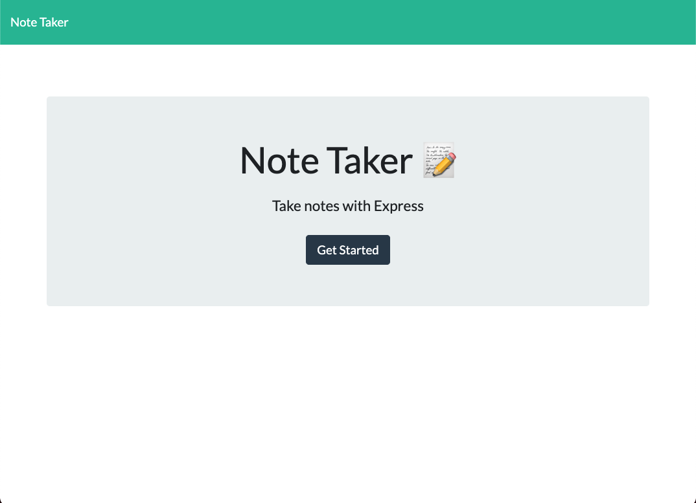
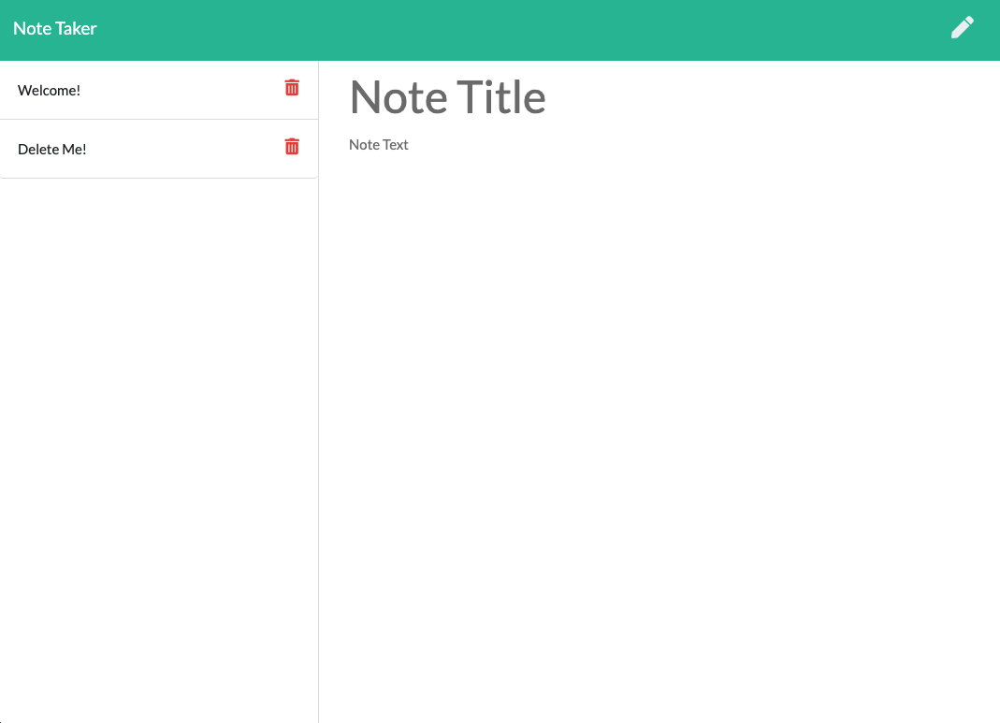

# Note Taker

## Table of Contents
* [Project Summary](#project-summary)
* [Technologies Used](#technologies-used)
* [How to Access](#how-to-access)
* [About Me](#about-me)
* [Screenshots](#screenshots)
---

## Project Summary
This is an application for taking notes. It allows the user to create and delete notes on a remote server.

## Technologies Used
* [JavaScript](https://developer.mozilla.org/en-US/docs/Web/JavaScript)
* [Node.js](https://nodejs.org/en/)
* [Express](https://expressjs.com/)

## How to Access
[Note Taker - Deployed on Heroku](https://ucb-jk-note-taker.herokuapp.com/) 
[Note Taker - GitHub Page](https://github.com/profjjk/note-taker)

## About Me
* [LinkedIn](https://www.linkedin.com/in/the-real-jordan-kelly/)
* [GitHub](https://github.com/profjjk)

## Screenshots

